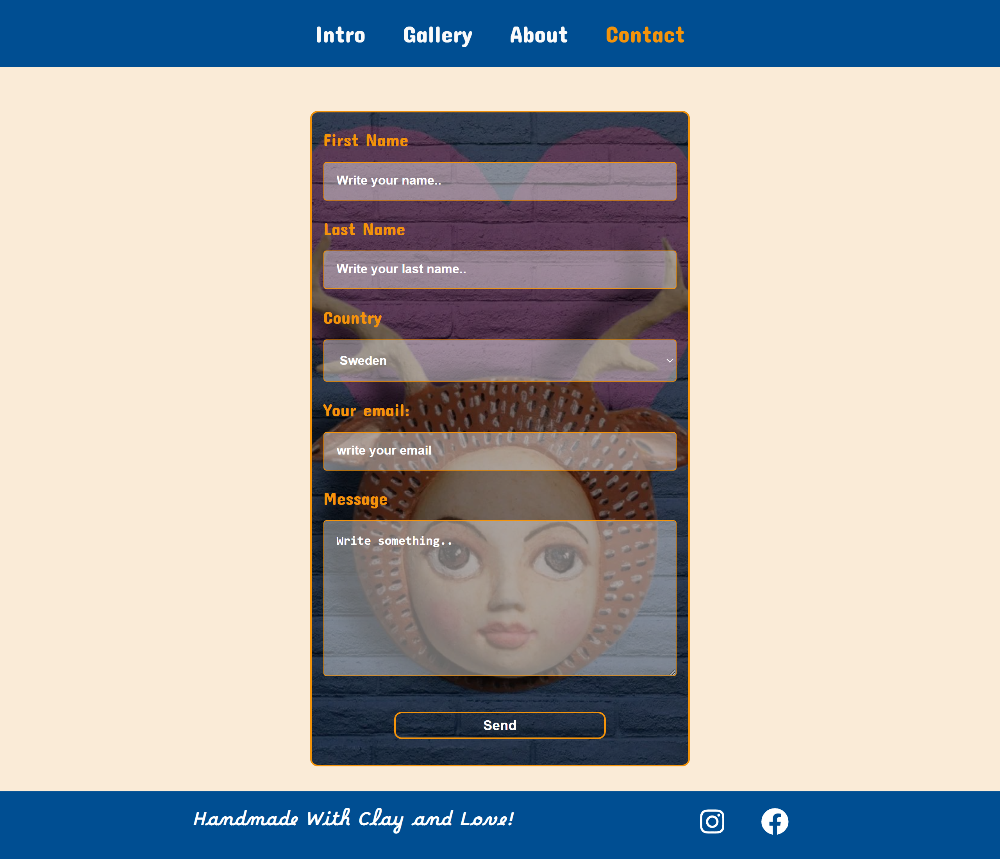

### September 2023

**Project Summary**

This HTML + CSS project, developed by Ursula Vallejo Janne for her HTML & CSS course, showcases a responsive web layout built entirely with CSS (no JavaScript). The main objective was to challenge and deepen understanding of CSS Grid (building on prior Flexbox knowledge), using REM units instead of pixels for scalable typography and spacing. Throughout development, Ursula referenced key Grid resources—such as Domestika’s “Web Layout with CSS Grid,” Grid by Malven, and Grid by Example—as well as hands-on exercises from freeCodeCamp on CodePen.

Project planning and task tracking were managed via a Trello board, ensuring a clear wireframe-to-final-layout workflow. Two initial wireframes guided the overall structure, which was then implemented with CSS Grid for page composition. Color choices (blue, pink, white, plus accent shades) were selected from Material Design Palette and defined as CSS variables; these were verified against accessibility standards using a color-contrast review tool. The final result is a clean, grid-based design that reflects both course objectives and best practices for scalable, accessible styling.

---

### 🛠️ Technologies Used

- **HTML**
- **Vainilla JavaScript**
- **CSS**

---

### General view:




---

### 🚀 How to Run the Project Locally

1. **Clone or download** the project folder

   ```bash
   git clone <your-repo-url>
   cd <project-folder>
   ```

2. **Open in browser**

   - Simply double-click `index.html`
   - **OR** serve via LiveServer / HTTP server

---

---

### 📄 [Detailed Information of the Project](Detail_Info.md)
