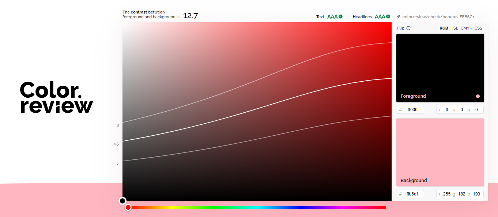

### September 2023

# [Demo Project-ITHögskola ](http://studentiths.se/ursula-vallejo)

## Project realized by Ursula Vallejo Janne for the Course HTML-CSS.

### Detailed information on the process of the project below:

The purpose of the project was to use only CSS-HMTL to create a project. On the WebApp, I tried to implement the information we review in the course and also the knowledge I gained in previous courses, specially one i did parallel to try to understand CSS-Grid in depth ( Domestika ).
As I am interested in being able to challenge myself with Grid (as flex already knew how to use it) I mainly used it for the layout of the project.

- Try to implement the use of REM instead of pixels. Used a Rem calculator:

[PX to REM Converter ](https://nekocalc.com/px-to-rem-converter)

- Below pages that i review to be able to understand Grid:

[CSS-Grid in depth: Web Layout with CSS Grid, Flexbox and other Modern Techniques ](https://www.domestika.org/en/courses/389-web-layout-with-css-grid-flexbox-and-other-modern-techniques)

[GRID Containers](https://grid.malven.co/)

[Grid by Example](https://gridbyexample.com/)

[freeCodeCamp: Build a Magazine / excersice on my codepen](https://codepen.io/collection/yrxmQj)

# Layout Project - wireframes :

[>](skiss-1.png)

[>](skiss-2.png)

# Planning : Trello

Below the link to acces the planning i followed in Trello ( is need it to have an account but its free):

[Trello Planning](https://trello.com/invite/b/NE2gJD1m/ATTI3e3756641f00fde2ee3d26301378e173AC1AE7B2/ithshtml-cssursulavallejo)

# Color Palette :

To see the color palette to use first took a look on the colors was interest in use (blue, pink, white) and see the possible color that match with them using material design palette.

[Material design palette](https://www.materialpalette.com/)

See bellow the 2 palettes took in consideration :

[](documentation/Material-Design-Color-Palette-Generator-Material-Palette1.png)

[](documentation/Material-Design-Color-Palette-Generator-Material-Palette2.png)

The colors decide to implement:

```css
:root {
  --background: #faebd7;
  --background-color: #007fff;
  --background-color-rosa: #ffb6c1;
  --primary-text: #000000;
  --secondary-text: #575656ff;
  --text-white: #ffffff;
  --primary-color: #004e92;
  --secondary-color: #eea849;
  --contrast-color: #f3930a;
}
```

Review color selection with color review to see if was working according accessibility:

[](documentation/Color-review-background-primarytext.png.png)

[](documentation/Color-review-background-primarytext-2.png)

[](documentation/Color-review-background-primarytext-4.png)

[](documentation/Color-review-background-primarytext-3.png)
